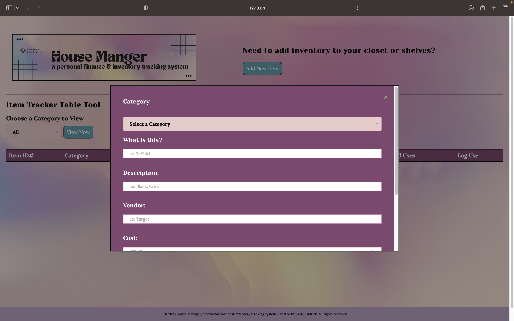
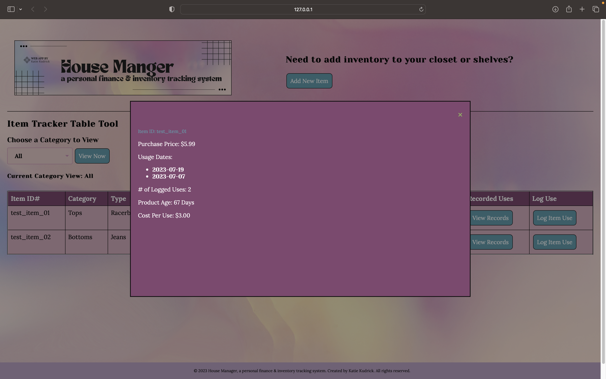
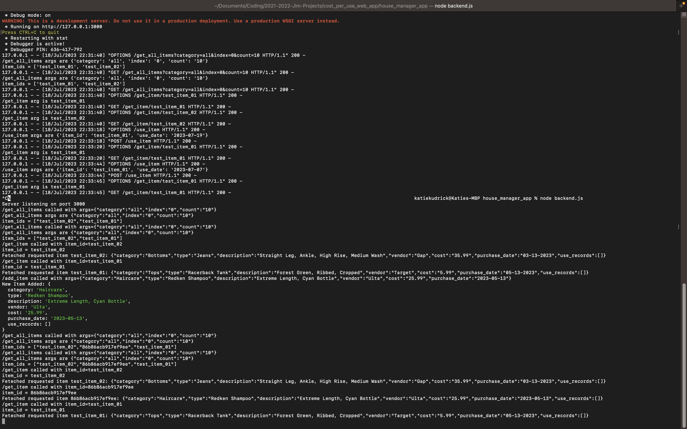

# house-manager-personal-inventory-system

House Manager: a personal finance & inventory tracking web application system by Katie Kudrick.

## ABOUT

Inspired by commercial inventory tracking systems, supply chain management concepts, and sales side CRMs, House Manager is an inventory tracking system where the user can input their personal, everyday items into the browser and view their data in a tabular interface. Here, the user can also log their item usage and calculate their cost per use to optimize the user's day-to-day buying power.

In the first prototype, the backend API was written in Python Flask and the frontend was written with vanilla JavaScript/HTML/CSS without frontend frameworks. The JavaScript frontend table is designed to look like established sales CRMs. In the current implementation, data is stored in memory and there are plans to add local flat file storage or a database in the future. As a learning exercise and for an additional challenge, I ported the Flask backend to JavaScript Express and verified that the existing frontend successfully works with both, without changing the frontend at all.

## API OVERVIEW

### /add_item
- POST request
- args: `{ 'category': <category>, 'type': <type>, 'description': <description>, 'vendor': <vendor>, 'cost': <cost>, 'purchase_date': <purchase_date> }`
- rtn: `{ 'item_id': <item_id> }`

### /use_item
- POST request
- args: `{ 'item_id': <item_id>, 'use_date': <use_date> }`
- rtn: `{ 'message': 'Item ' + <item_id> + ' use recorded.' }`

### /get_item/<item_id>
- GET request
- args: `item_id` (in URL)
- rtn:`{'item_id': <item_id>,'category': <category>,'type': <type>,'description': <description>,'vendor': <vendor>,'cost': <cost>,'purchase_date': <purchase_date>,'use_records': <use_records>}`

### /get_all_items
- GET request
- args: `{ 'category': <category>, 'index': <index>, 'count': <count> }`
- rtn: `{ 'item_ids': [ '<item_id0>', '<item_id1>', ...] }`

### /get_categories
- GET request
- args: (none)
- rtn: `[ '<category0>', '<category1>', ... ]`

## RUN INSTRUCTIONS FOR FLASK BACKEND

In your terminal, from the top level of this Git repo:

`$ cd house_manager_app`
`$ python3 backend.py`

Note: This serves the backend on port 3000.

Load frontend file `index.html` in your web browser to start the app. (Detailed user experience instructions in the following section.)

## RUN INSTRUCTIONS FOR EXPRESS BACKEND

In your terminal, from the top level of this Git repo:

`$ cd house_manager_app`
`$ node backend.js`

Note: This serves the backend on port 3000.

Load frontend file `index.html` in your web browser to start the app.

See the following section for detailed user experience instructions.

## GUI OVERVIEW

In House Manager, the user is first visually directed to the Add New Item button. Clicking launches the Add Item pop-up window.

Here in an overlayed form, the user chooses an item Category from a drop-down selector, then inputs text for Type, Description, Vendor, Cost, and Purchase Date. Lastly, they click the Add New Item button to submit the data to the server.

After adding an item, a message appears alerting the user of a successful item add. Thusly, they have the option to add another item (the form is cleared upon submission) or click outside of the pop-up or click the upper-right 'X' icon to return to the home screen.

Midpage below the navbar, the user can view all items or a specific Category to view from the inventory drop-down selector. Clicking the View Now button generates the item data in an interactive table.

In addition to the details inputted by the user, each item row features two buttons: Log Use and View Records.

Clicking the Log Use button triggers an alert pop-up window so the user can input that item's usage date, whether it is today, past, or future. Submitting the date simultaneously posts to the key created by the API at the time of the item add to their inventory and closes the pop-up box.

This new item information can then be viewed after clicking that item's View Records button. This displays the Item Detail pop-up window where the item's usage with a list of the logged dates, a tally of the number of logged dates, the item's original cost, and its current calculated cost per use.

## POTENTIAL FUTURE FEATURES

- Port frontend to React/MUI.
- Personal finance budgeting system that is centered on a visual calendar.
- Calendar-based budgeting system projects spending based on tracked item usage and purchase rate.
- Postgres database on the back end.
- Shopping list and reorder time with reminders.
- Compare most recent vendors with current best prices.
- Connect to Pinterest API to build visual wardrobe boards that allow users to track usage by predetermined outfits.
- Build an iPhone app front end.
- Encrypted cloud storage option.
- Private local database tracking option.
